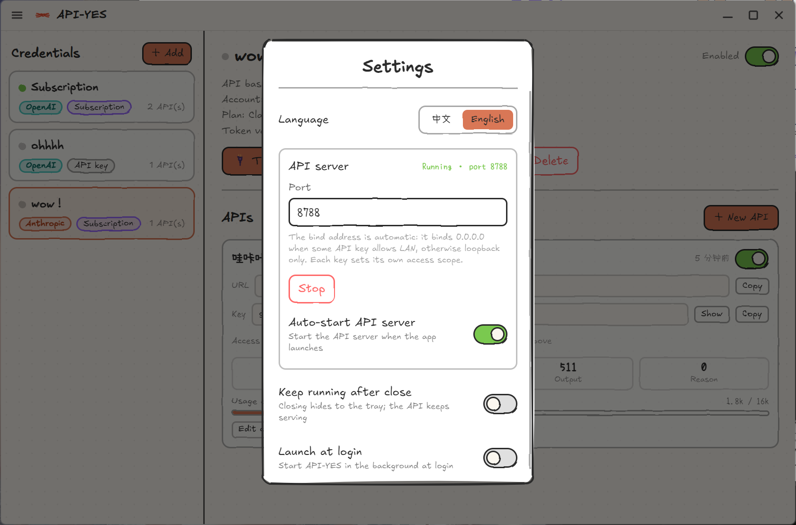

<div align="center">
  

  <h3>A hand-drawn local tool for managing your own API keys.</h3>
  <p>Gather your own API keys in one place and keep them organized — all in a warm, doodle-style window. For personal use only.</p>

  <p>
    <a href="./LICENSE"></a>
    
    
    
  </p>

  <h4>
    English &nbsp;|&nbsp; <a href="./README.zh-CN.md">简体中文</a>
  </h4>
</div>

<br />

<div align="center">
  
</div>

<br />

API YES is a tiny desktop app that gathers your own API keys in one place and keeps them organized — and shows you, at a glance, how many tokens each one is burning. It does one thing: it helps you manage **your own** API keys, for **your own** use. Everything is hand-drawn — wobbly Rough.js borders, the Excalifont typeface, a warm paper grid — so a job that's usually a sterile dashboard feels like scribbling in the corner of a notebook.

## ⚠️ Before you use it

- API YES is only for managing **API keys you own** — **for personal use only**.
- Use only API keys you have obtained legitimately, and comply with each provider's terms.
- **Do not offer it as a service to others, and do not share accounts or keys** — never make it available for anyone else to use.
- You are solely responsible for how you use it and for any consequences.

## Features

- 🎨&nbsp;&nbsp;**Hand-drawn, everywhere** — sketchy Rough.js borders, Excalifont + Xiaolai (小赖), a warm paper-grid canvas.
- 🔑&nbsp;&nbsp;**Use your own API key** — paste in your own **API key** (custom & relay base URLs welcome). Every key stays local, for your own use.
- 🔌&nbsp;&nbsp;**Local access for each key** — give every key _any number_ of local URLs, each with its own address + key, so you can keep them organized. Point your tool's base URL at it and go.
- 📊&nbsp;&nbsp;**Per-key metering** — requests, input / output / cached / reasoning tokens, broken down by model and resettable any time.
- 🚦&nbsp;&nbsp;**Token caps** — set a total-token ceiling per key; it returns 429 once it's used up.
- 🌐&nbsp;&nbsp;**Per-key access scope** — keep a key loopback-only, or flip it to **Allow LAN**. The server binds `0.0.0.0` only when some key opts in; loopback-only keys are still 403-gated.
- 🧠&nbsp;&nbsp;**Format-faithful** — requests and responses pass through untouched, so special params aren't dropped.
- 🌍&nbsp;&nbsp;**Bilingual UI** — switch the _entire_ app between **English** and **中文** on the fly.
- 🌓&nbsp;&nbsp;**Light / dark paper** themes.
- 🖥️&nbsp;&nbsp;**Run in background** — minimize to a tray, auto-start the server on launch, launch at login.
- 🔄&nbsp;&nbsp;**Silent auto-update** — new versions download, install, and relaunch on their own (Windows / Linux).
- 🔒&nbsp;&nbsp;**Local-first & encrypted** — everything lives in one local file; API keys are encrypted with the OS keychain (`safeStorage`). Nothing leaves your machine except the upstream calls you make.
- 🖥️&nbsp;&nbsp;**Cross-platform** — Windows, macOS and Linux (Electron).
- ⚒️&nbsp;&nbsp;**Hackable core** — a typed query / command / event contract drives the whole app.

## Why API YES?

I have a few of my own API keys scattered around, but all my little scripts and tools just want a plain **base URL + key**. I wanted a warm little control panel that lives on my desktop, gathers my own keys in one place, keeps them organized so my tools can actually use them, and shows me — at a glance — how many tokens each one is eating. Most tools like this are grey dashboards and rigid forms; I wanted something that bounces when you poke it and doodles in the margins.

So I started building it for myself. **This is a personal project**, and now that this version feels good, I'll keep polishing it in my spare time. If you have an idea, a wish, or you hit a bug, **please open an [issue](../../issues)!** 💛

## Quick start — three steps

1. In **Settings**, make sure the **API server** is running (default `127.0.0.1:8788`; the port is editable and it auto-starts by default).
2. **Add your own API key** → open it → **New API** → copy its URL + key.
3. Point your tool's base URL at it:
   - Clients that expect a `/v1` base URL → `http://127.0.0.1:8788/v1`, API key = the key you copied.
   - Clients that expect a root base URL → `http://127.0.0.1:8788`, API key = the key you copied.
4. Call as usual — usage tallies live on that key.

> Tip: right-click a key in the left list for a quick **test / rename / delete** menu.

## Getting started (development)

API YES is built with Electron + Vite + React.

```bash
# install dependencies
npm install

# run in dev mode (hot reload, uses a separate dev data folder)
npm run dev

# type-check
npm run typecheck

# production build → out/
npm run build

# package an installer for your OS
npm run build:win     # Windows
npm run build:mac     # macOS
npm run build:linux   # Linux
```

Your data is stored locally in your OS app-data folder (API keys encrypted via the OS keychain):

- **Windows** — `%APPDATA%\API-YES\api-yes.json`
- **macOS** — `~/Library/Application Support/API-YES/api-yes.json`
- **Linux** — `~/.config/API-YES/api-yes.json`

On **macOS**, because the build is unsigned, drag `API-YES.app` into `/Applications` and then run:

```bash
sudo xattr -cr /Applications/API-YES.app
# if it still says "damaged", add a local ad-hoc signature:
sudo codesign --force --deep --sign - /Applications/API-YES.app
```

On **Linux (deb)**, if the sandbox complains, give `chrome-sandbox` the setuid bit:

```bash
sudo apt install -y ./API-YES_*_amd64.deb
sudo chmod 4755 /opt/API-YES/chrome-sandbox
```

## Tech stack

Electron · electron-vite · React 19 · Zustand · Tailwind CSS · framer-motion · Rough.js · TypeScript.

## License

API YES is released under the [GNU GPLv3](./LICENSE).

Any modified or derivative version — whether **distributed** or **offered as a network service** — must:

- stay licensed under **GPLv3 / AGPLv3**,
- **keep the original copyright notice**,
- **clearly state what was changed**.
