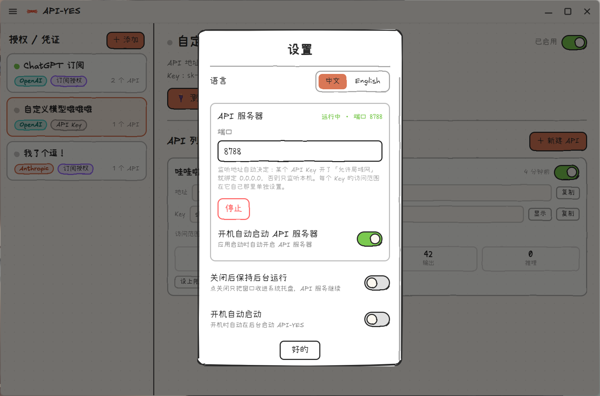

<div align="center">
  

  <h1>API&nbsp;YES</h1>

  <h3>管理你自己的 API Key 的手绘风本地小工具。</h3>
  <p>把你自己的 API Key 收拢到一处，集中整理、管好、给自己用 —— 全程在一个温暖的涂鸦风窗口里完成。仅供个人使用。</p>

  <p>
    <a href="./LICENSE"></a>
    
    
    
  </p>

  <h4>
    <a href="./README.md">English</a> &nbsp;|&nbsp; 简体中文
  </h4>
</div>

<br />

<div align="center">
  
</div>

<br />

API YES 是一个小小的桌面应用，帮你把散落各处的 API Key 收拢到一处，分门别类地管好。它只做一件事：帮你管理**自己的** API Key，给**自己**用 —— 顺手还能一眼看清每把 Key 用了多少 token。这里的一切都是手绘的 —— Rough.js 抖动的线条、Excalifont 手写字体、温暖的纸张网格 —— 让一件本该是冰冷仪表盘的事，变得像在本子角落里涂鸦。

## ⚠️ 使用须知

- 本项目只用来管理**你自己拥有的 API Key**，**仅供个人使用**。
- 请只使用你自己合法获取的 API Key，并自行遵守对应服务商的条款。
- **请勿对外提供服务、请勿共享账号或 Key**，也不要把它开放给他人使用。
- 一切使用风险与后果，均由使用者自行承担。

## 功能特性

- 🎨&nbsp;&nbsp;**处处手绘** —— Rough.js 手绘线框、Excalifont + 小赖字体、暖色纸张网格画布。
- 🔑&nbsp;&nbsp;**用你自己的 API Key** —— 粘贴你自己的 **API Key**（支持自建 / 中转地址）。所有 Key 都留在本地，只给你自己用。
- 🔌&nbsp;&nbsp;**为每个 Key 生成本地访问地址** —— 给每个 Key 生成**任意多个**本地访问入口，各有独立地址 + Key，方便分门别类地管理。把工具的 base URL 指过去就能用。
- 📊&nbsp;&nbsp;**按 Key 计量** —— 请求数、输入 / 输出 / 缓存 / 推理 tokens，可按模型细分、随时清零。
- 🚦&nbsp;&nbsp;**用量上限** —— 给每个 Key 设总 token 上限，用尽即返回 429。
- 🌐&nbsp;&nbsp;**按 Key 控制访问范围** —— 某个 Key 可设为「仅本机」，也可改成「允许局域网」。只有当某个 Key 开了局域网，服务器才会绑定 `0.0.0.0`；仅本机的 Key 依然有 403 兜底。
- 🧠&nbsp;&nbsp;**格式保真** —— 请求与响应原样直通，特殊参数不会被吞掉。
- 🌍&nbsp;&nbsp;**双语界面** —— **中文 / English** 全局一键实时切换。
- 🌓&nbsp;&nbsp;**白天 / 夜间**纸张主题。
- 🖥️&nbsp;&nbsp;**后台运行** —— 关闭收进系统托盘、开机自动启动服务、开机自启。
- 🔄&nbsp;&nbsp;**静默自动更新** —— 有新版会自动下载、安装并重启（Windows / Linux）。
- 🔒&nbsp;&nbsp;**本地优先、加密存储** —— 所有数据都在本地的单个文件里；API Key 用系统钥匙串（`safeStorage`）加密。除了你主动发起的上游调用，没有任何东西离开你的电脑。
- 🖥️&nbsp;&nbsp;**跨平台** —— Windows、macOS、Linux（基于 Electron）。
- ⚒️&nbsp;&nbsp;**可扩展内核** —— 带类型的 query / command / event 契约驱动整个应用。

## 我为什么要做 API YES？

自己的 API Key 散落在各处，但我那些小脚本、小工具只认一个朴素的 **base URL + Key**。我想要一个待在桌面上的温暖小面板：把自己的 Key 收拢到一处、统一管好，让工具能直接用，还能一眼看清每把 Key 吃了多少 token。大多数这类工具都是灰扑扑的仪表盘和死板的表单；而我想要的，是戳一下会弹一弹、边角还会涂鸦的那种东西。

于是我就先为自己做了它。**这是一个个人项目**，现在这一版我自己用着挺顺手了，之后只要有空我就会继续打磨。如果你有任何想法、心愿，或者发现了 bug —— **欢迎在 [issues](../../issues) 里告诉我！** 💛

## 快速上手 —— 三步开始用

1. 在「**设置**」里确认 **API 服务器**已启动（默认 `127.0.0.1:8788`，端口可改，默认开机自动启动）。
2. **添加你自己的 API Key** → 点开它 → **新建 API** → 复制它的地址和 Key。
3. 把你工具里的 base URL 指过去：
   - 需要 `/v1` 结尾地址的客户端 → `http://127.0.0.1:8788/v1`，API Key 填刚才复制的 Key。
   - 需要根地址的客户端 → `http://127.0.0.1:8788`，API Key 填刚才复制的 Key。
4. 正常调用即可 —— 消耗会实时累计到这把 Key 上。

> 小技巧：在左侧列表的 Key 上**右击**，可以快速「测试连接 / 重命名 / 删除」。

## 开始使用（开发）

API YES 基于 Electron + Vite + React 构建。

```bash
# 安装依赖
npm install

# 开发模式运行（热更新，使用独立的开发数据目录）
npm run dev

# 类型检查
npm run typecheck

# 生产构建 → out/
npm run build

# 为你的系统打包安装程序
npm run build:win     # Windows
npm run build:mac     # macOS
npm run build:linux   # Linux
```

数据保存在系统的应用数据目录里（API Key 经系统钥匙串加密）：

- **Windows** —— `%APPDATA%\API-YES\api-yes.json`
- **macOS** —— `~/Library/Application Support/API-YES/api-yes.json`
- **Linux** —— `~/.config/API-YES/api-yes.json`

**macOS** 上由于安装包未签名，把 `API-YES.app` 拖进「应用程序」后，打开终端运行：

```bash
sudo xattr -cr /Applications/API-YES.app
# 如果还是提示「已损坏」，再补一条本地 ad-hoc 签名：
sudo codesign --force --deep --sign - /Applications/API-YES.app
```

**Linux（deb）** 上如果沙箱报错，给 `chrome-sandbox` 设置 setuid 位：

```bash
sudo apt install -y ./API-YES_*_amd64.deb
sudo chmod 4755 /opt/API-YES/chrome-sandbox
```

## 技术栈

Electron · electron-vite · React 19 · Zustand · Tailwind CSS · framer-motion · Rough.js · TypeScript。

## 许可证

API YES 基于 [GNU GPLv3](./LICENSE) 开源。

任何修改版或衍生版 —— 无论是以**分发**还是**网络服务**的形式提供 —— 都必须：

- 继续以 **GPLv3 / AGPLv3** 许可，
- **保留原始版权声明**，
- **明确标注所做的修改**。
